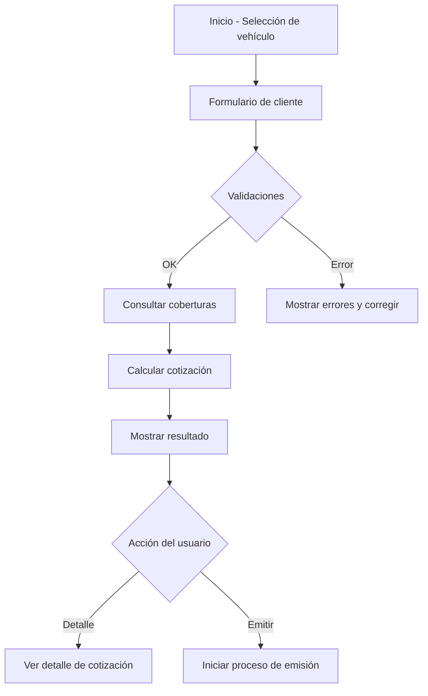
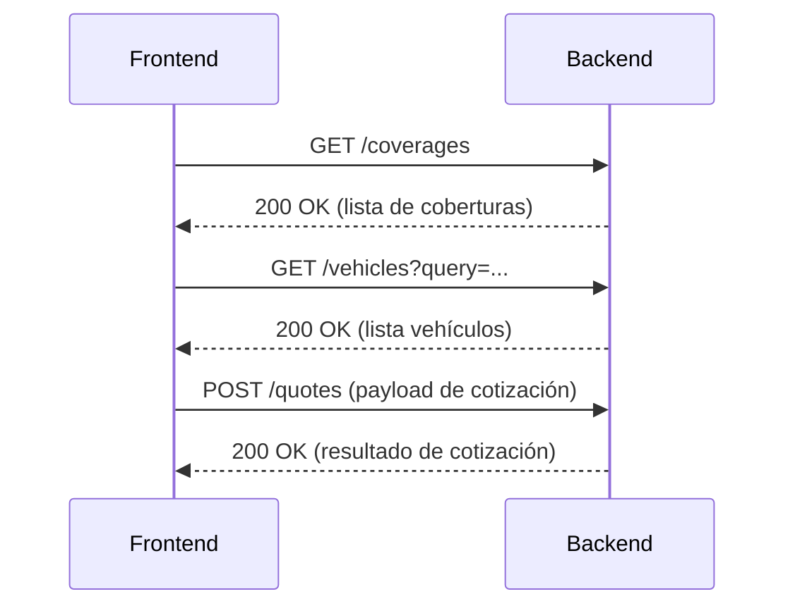

# insurtech-quote (insurtech-quote-front)

## Resumen

Aplicación frontend para un sistema de cotización de seguros automotor. Provee interfaz para seleccionar vehículo, ingresar datos de cliente y calcular cotizaciones basadas en coberturas disponibles. Está construida con Quasar (Vue 3 + Vite) y orientada a integrarse con servicios backend REST.

## Audiencia objetivo

- Analistas funcionales y técnicos
- Desarrolladores frontend
- QA / DevOps que despliegan el frontend

## Requisitos previos

- Node.js (>=16 recomendado)
- Yarn o npm
- Acceso al backend de cotizaciones (endpoints REST) o configuración de mocks

## Instalación

Usando Yarn:

```bash
yarn
```

Usando npm:

```bash
npm install
```

## Comandos disponibles

- Desarrollo con recarga caliente:

```bash
quasar dev
```

- Lint (analizador estático):

```bash
yarn lint
# o
npm run lint
```

- Formateo de código:

```bash
yarn format
# o
npm run format
```

- Build para producción:

```bash
quasar build
```

## Estructura del proyecto (resumen)

- `src/` — Código fuente principal
  - `components/` — Componentes Vue reutilizables (selector de cobertura, formulario cliente, resultado de cotización, selector de vehículo)
  - `pages/` — Páginas de la aplicación (`QuotePage`, `QuoteDetailPage`)
  - `services/api/` — Servicios que consumen el backend (`coverage.service.ts`, `customer.service.ts`, `quote.service.ts`, `vehicle.service.ts`)
  - `composables/` — Hooks reutilizables (`useFormValidation.ts`, `useQuoteCalculator.ts`)
  - `boot/axios.ts` — Configuración global de Axios
  - `router/` — Rutas de la aplicación

## Flujo funcional (alto nivel)

1. Usuario selecciona o ingresa datos del vehículo.
2. Usuario completa los datos del cliente en el formulario.
3. El sistema consulta coberturas disponibles y calcula la cotización.
4. Se presenta el resultado con opciones para detalle o continuar proceso de emisión (si aplica).

## Integración con backend

Los servicios en `src/services/api/` encapsulan llamadas HTTP. Asegúrate de configurar la URL base de Axios en `src/boot/axios.ts`. Endpoints esperados (ejemplos):

- `GET /coverages` — listar coberturas
- `GET /vehicles` — buscar vehículos / modelos
- `POST /quotes` — calcular cotización
- `POST /customers` — crear/actualizar cliente

## Buenas prácticas y consideraciones técnicas

- Validar en frontend y repetir validaciones críticas en backend.
- Manejar errores de red y mostrar mensajes de error claros al usuario.
- Implementar tests unitarios para `composables` y servicios API.
- Mantener las reglas de negocio en `useQuoteCalculator.ts` bien documentadas y cubiertas por pruebas.

## Despliegue

El build genera los artefactos estáticos que puede servir cualquier CDN o servidor HTTP. Ejemplo de pasos:

```bash
quasar build
# luego subir la carpeta dist/spa a su servidor/CDN
```

## Diagramas de flujo

Diagrama del flujo principal de cotización:



Diagrama de integración con backend:



## Requerimientos no funcionales

- Rendimiento: tiempo de respuesta objetivo < 300 ms para llamadas al backend en condiciones normales de red.
- Disponibilidad: la aplicación debe poder desplegarse en entornos con alta disponibilidad; artefactos estáticos servidos desde CDN.
- Seguridad: todas las llamadas al backend deben usar HTTPS; no almacenar datos sensibles en localStorage sin cifrado.
- Escalabilidad: el frontend debe ser capaz de integrarse con APIs que escalen horizontalmente sin cambios en cliente.
- Observabilidad: exponer métricas básicas (errores JS, tiempos de carga) y logs de cliente para facilitar debugging.
- Accesibilidad: cumplir WCAG 2.1 AA en formularios críticos (etiquetas, focus, contrastes).
- Localización: diseño preparado para textos dinámicos y formatos locales (fechas, números); soporte inicial en español.
- Mantenibilidad: código organizado en `components`, `composables` y `services/api`; cobertura de pruebas mínima para reglas de negocio.

## Notas adicionales

- Para pruebas locales sin backend, considere crear mocks en `src/services/api` o usar herramientas como `msw`.

## Contacto

Para dudas funcionales o técnicas, contactar al equipo de producto o al equipo de desarrollo responsable del repositorio.

## Licencia

Licencia MIT.
